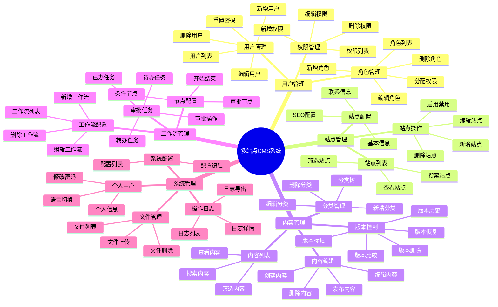
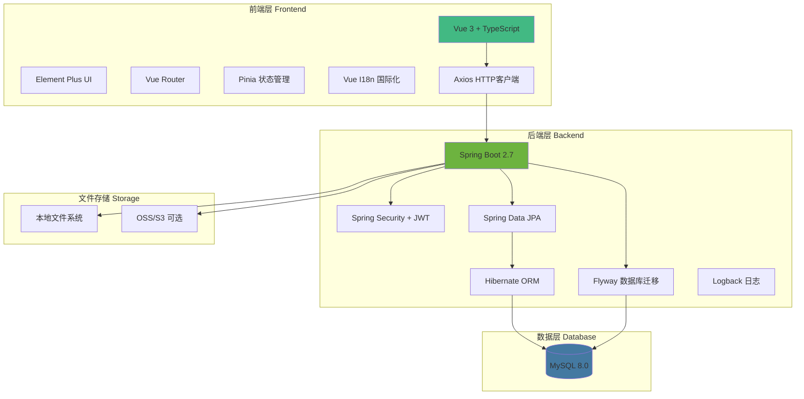
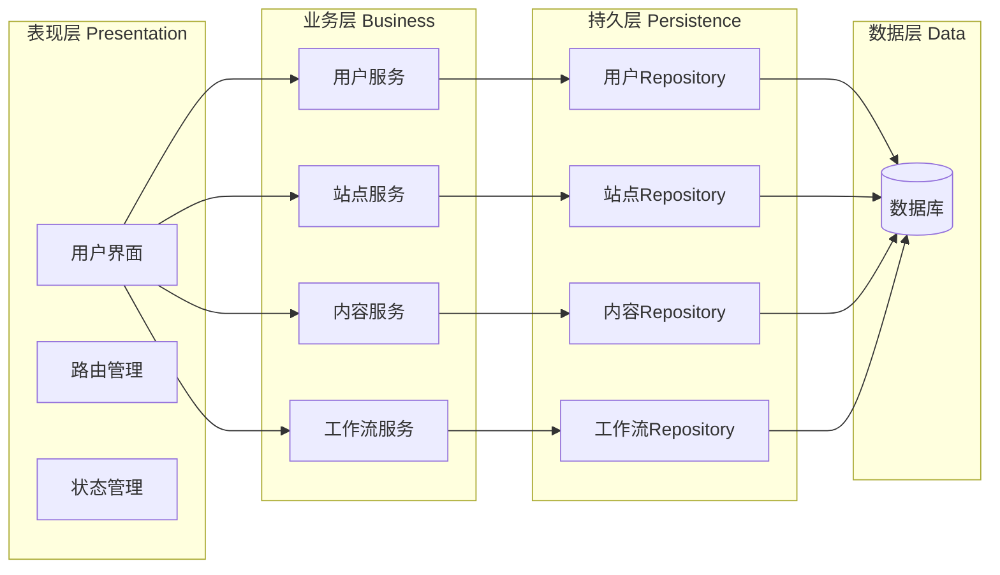
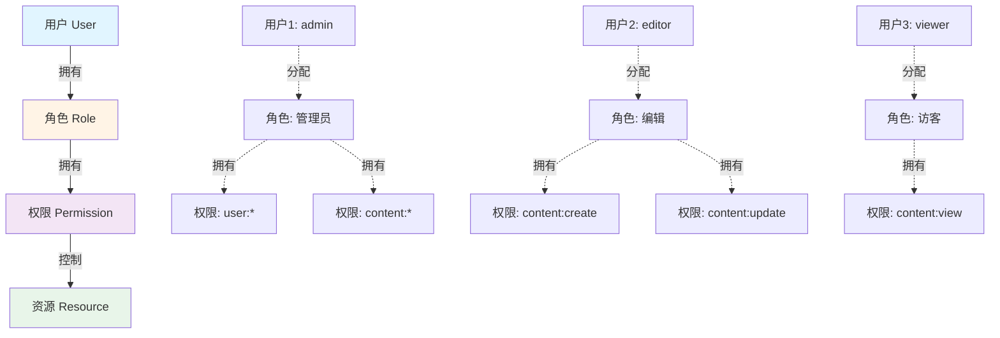
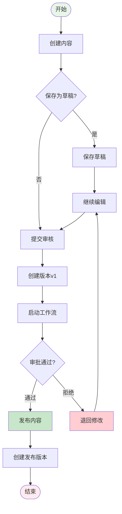
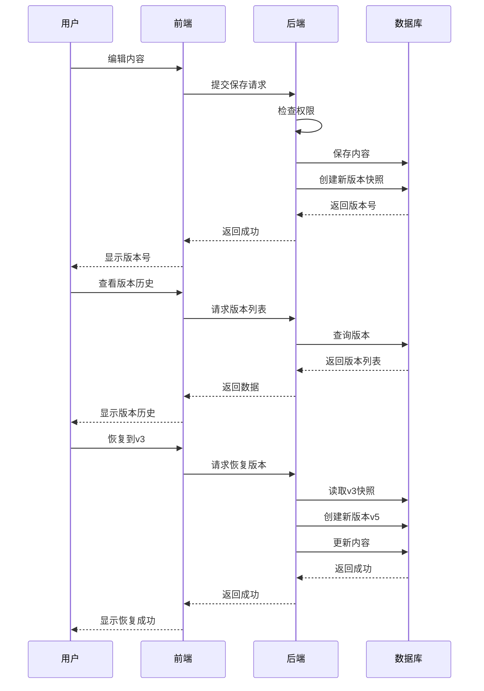
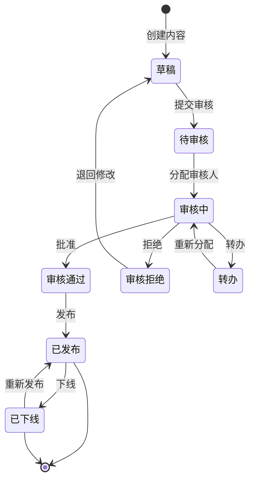
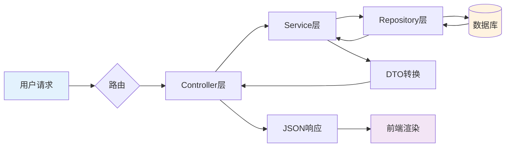
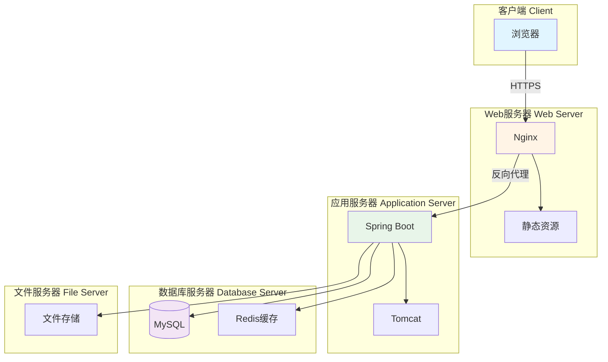
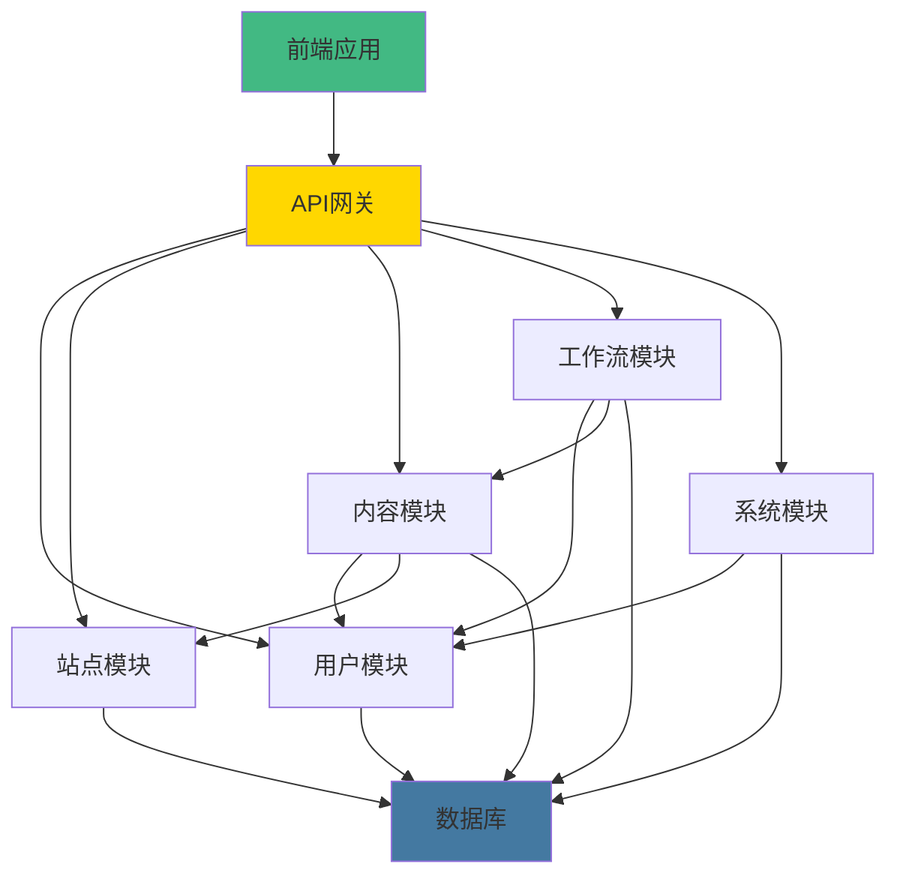

# 系统功能结构图 - Mermaid代码

本文件包含可以生成系统功能结构图的Mermaid代码。

## 免费生成图片的网站

1. **Mermaid Live Editor**（推荐）
   - 网址：https://mermaid.live/
   - 使用：复制代码 → 粘贴 → 导出PNG/SVG

2. **Draw.io**
   - 网址：https://app.diagrams.net/
   - 使用：Arrange → Insert → Advanced → Mermaid

3. **Markdown编辑器**
   - Typora、VS Code、Obsidian等

---

## 系统功能结构图（思维导图）

---

## 系统架构图

---

## 技术架构图（分层）

---

## 用户权限模型图

---

## 内容发布流程图

---

## 版本控制流程图

---

## 工作流执行流程图

---

## 数据流图

---

## 部署架构图

---

## 模块依赖关系图

---

## 使用步骤

### 1. 在线生成（最简单）

1. 访问：https://mermaid.live/
2. 复制上面任意一个代码块
3. 粘贴到左侧编辑器
4. 右侧自动显示图表
5. 点击右上角"Actions" → "Download PNG"

### 2. 使用Draw.io

1. 访问：https://app.diagrams.net/
2. 点击菜单：Arrange → Insert → Advanced → Mermaid
3. 粘贴代码
4. 点击"Insert"
5. 可以进一步编辑和美化
6. 导出为PNG/PDF

### 3. 使用Typora（本地）

1. 打开Typora
2. 创建新文档
3. 插入代码块，语言选择`mermaid`
4. 粘贴代码
5. 自动渲染
6. 右键导出为图片

---

## 图表说明

| 图表类型 | 用途 | 推荐场景 |
|---------|------|---------|
| mindmap | 思维导图 | 功能结构展示 |
| graph | 流程图/架构图 | 系统架构、数据流 |
| flowchart | 流程图 | 业务流程 |
| sequenceDiagram | 时序图 | 交互流程 |
| stateDiagram | 状态图 | 状态转换 |

---

**创建日期**：2025-10-07  
**工具版本**：Mermaid 10.x

