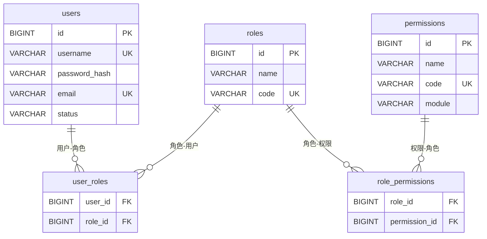
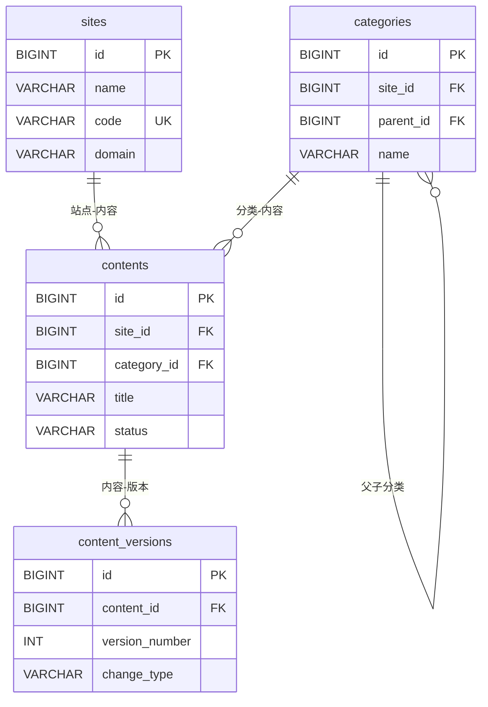
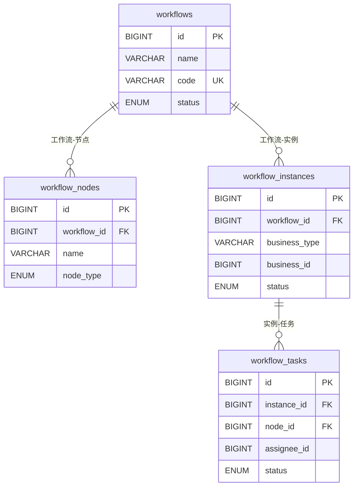

# 数据库ER图 - Mermaid代码

本文件包含可以生成ER图的Mermaid代码。

## 如何使用

### 方法1：在线生成（推荐）

访问以下免费网站，复制下面的代码粘贴即可生成图片：

1. **Mermaid Live Editor**（推荐）
   - 网址：https://mermaid.live/
   - 特点：官方工具，功能最全，可导出PNG/SVG/PDF
   - 使用：直接粘贴代码，点击右上角下载按钮

2. **Draw.io**
   - 网址：https://app.diagrams.net/
   - 特点：功能强大，支持多种图表
   - 使用：Arrange → Insert → Advanced → Mermaid

3. **Markdown编辑器**
   - Typora：支持Mermaid实时预览
   - VS Code：安装Mermaid插件
   - Obsidian：原生支持Mermaid

### 方法2：命令行生成

```bash
# 安装mermaid-cli
npm install -g @mermaid-js/mermaid-cli

# 生成图片
mmdc -i ER图-Mermaid代码.md -o ER图.png
```

---

## 完整ER图代码

```mermaid
erDiagram
    %% ========================================
    %% 用户管理模块
    %% ========================================
    
    users ||--o{ user_roles : "has"
    users {
        BIGINT id PK "用户ID"
        VARCHAR username UK "用户名"
        VARCHAR password_hash "密码哈希"
        VARCHAR email UK "邮箱"
        VARCHAR phone "手机号"
        VARCHAR nickname "昵称"
        VARCHAR avatar_url "头像URL"
        VARCHAR status "状态"
        DATETIME last_login_at "最后登录时间"
        VARCHAR last_login_ip "最后登录IP"
        DATETIME created_at "创建时间"
        DATETIME updated_at "更新时间"
        BIGINT created_by "创建人ID"
        BIGINT updated_by "更新人ID"
        TINYINT deleted "软删除标记"
        INT version "版本号"
    }
    
    roles ||--o{ user_roles : "has"
    roles ||--o{ role_permissions : "has"
    roles {
        BIGINT id PK "角色ID"
        VARCHAR name "角色名称"
        VARCHAR code UK "角色编码"
        VARCHAR description "描述"
        TINYINT is_system "系统角色标记"
        INT sort_order "排序"
        DATETIME created_at "创建时间"
        DATETIME updated_at "更新时间"
        BIGINT created_by "创建人ID"
        BIGINT updated_by "更新人ID"
        TINYINT deleted "软删除标记"
    }
    
    permissions ||--o{ role_permissions : "has"
    permissions {
        BIGINT id PK "权限ID"
        VARCHAR name "权限名称"
        VARCHAR code UK "权限编码"
        VARCHAR description "描述"
        VARCHAR module "模块"
        VARCHAR resource "资源"
        VARCHAR action "操作"
        TINYINT is_system "系统权限标记"
        INT sort_order "排序"
        DATETIME created_at "创建时间"
        DATETIME updated_at "更新时间"
        BIGINT created_by "创建人ID"
        BIGINT updated_by "更新人ID"
        TINYINT deleted "软删除标记"
    }
    
    user_roles {
        BIGINT id PK "主键"
        BIGINT user_id FK "用户ID"
        BIGINT role_id FK "角色ID"
        BIGINT granted_by "授权人ID"
        DATETIME granted_at "授权时间"
    }
    
    role_permissions {
        BIGINT id PK "主键"
        BIGINT role_id FK "角色ID"
        BIGINT permission_id FK "权限ID"
    }
    
    %% ========================================
    %% 站点管理模块
    %% ========================================
    
    sites ||--o{ categories : "has"
    sites ||--o{ contents : "has"
    sites {
        BIGINT id PK "站点ID"
        VARCHAR name "站点名称"
        VARCHAR code UK "站点编码"
        VARCHAR domain "域名"
        VARCHAR description "描述"
        VARCHAR logo_url "Logo URL"
        VARCHAR favicon_url "Favicon URL"
        VARCHAR language "语言"
        VARCHAR timezone "时区"
        VARCHAR status "状态"
        TINYINT is_default "默认站点标记"
        VARCHAR seo_title "SEO标题"
        VARCHAR seo_keywords "SEO关键词"
        VARCHAR seo_description "SEO描述"
        VARCHAR contact_email "联系邮箱"
        VARCHAR contact_phone "联系电话"
        VARCHAR contact_address "联系地址"
        DATETIME created_at "创建时间"
        DATETIME updated_at "更新时间"
        BIGINT created_by "创建人ID"
        BIGINT updated_by "更新人ID"
        TINYINT deleted "软删除标记"
        INT version "版本号"
    }
    
    %% ========================================
    %% 内容管理模块
    %% ========================================
    
    categories ||--o{ categories : "parent"
    categories ||--o{ contents : "has"
    categories {
        BIGINT id PK "分类ID"
        BIGINT site_id FK "站点ID"
        BIGINT parent_id FK "父分类ID"
        VARCHAR name "分类名称"
        VARCHAR code "分类编码"
        VARCHAR description "描述"
        VARCHAR icon "图标"
        INT sort_order "排序"
        INT level "层级"
        VARCHAR path "路径"
        TINYINT is_visible "是否可见"
        DATETIME created_at "创建时间"
        DATETIME updated_at "更新时间"
        BIGINT created_by "创建人ID"
        BIGINT updated_by "更新人ID"
        TINYINT deleted "软删除标记"
        INT version "版本号"
    }
    
    contents ||--o{ content_versions : "has"
    contents ||--o{ content_version_logs : "has"
    contents {
        BIGINT id PK "内容ID"
        BIGINT site_id FK "站点ID"
        BIGINT category_id FK "分类ID"
        VARCHAR title "标题"
        VARCHAR slug UK "URL别名"
        TEXT summary "摘要"
        LONGTEXT content "内容"
        VARCHAR cover_image "封面图"
        VARCHAR content_type "内容类型"
        BIGINT author_id "作者ID"
        VARCHAR author_name "作者名称"
        VARCHAR status "状态"
        TINYINT is_top "是否置顶"
        TINYINT is_recommend "是否推荐"
        BIGINT view_count "浏览次数"
        DATETIME published_at "发布时间"
        DATETIME created_at "创建时间"
        DATETIME updated_at "更新时间"
        BIGINT created_by "创建人ID"
        BIGINT updated_by "更新人ID"
        TINYINT deleted "软删除标记"
        INT version "版本号"
    }
    
    content_versions ||--o{ content_version_logs : "has"
    content_versions {
        BIGINT id PK "版本ID"
        BIGINT content_id FK "内容ID"
        INT version_number "版本号"
        VARCHAR title "标题快照"
        VARCHAR slug "URL别名快照"
        TEXT summary "摘要快照"
        LONGTEXT content "内容快照"
        VARCHAR cover_image "封面图快照"
        VARCHAR content_type "内容类型快照"
        VARCHAR status "状态快照"
        BOOLEAN is_top "是否置顶快照"
        BOOLEAN is_featured "是否推荐快照"
        BOOLEAN is_original "是否原创快照"
        JSON tags "标签快照"
        JSON metadata "元数据快照"
        VARCHAR change_summary "修改摘要"
        VARCHAR change_type "修改类型"
        BIGINT created_by "创建人ID"
        VARCHAR created_by_name "创建人姓名"
        DATETIME created_at "创建时间"
        BOOLEAN is_tagged "是否标记"
        VARCHAR tag_name "版本标签"
        BIGINT file_size "文件大小"
    }
    
    content_version_logs {
        BIGINT id PK "日志ID"
        BIGINT content_id FK "内容ID"
        BIGINT version_id FK "版本ID"
        VARCHAR operation_type "操作类型"
        BIGINT operator_id "操作人ID"
        VARCHAR operator_name "操作人姓名"
        JSON operation_detail "操作详情"
        VARCHAR ip_address "IP地址"
        VARCHAR user_agent "用户代理"
        DATETIME created_at "操作时间"
    }
    
    %% ========================================
    %% 工作流管理模块
    %% ========================================
    
    workflows ||--o{ workflow_nodes : "has"
    workflows ||--o{ workflow_instances : "has"
    workflows {
        BIGINT id PK "工作流ID"
        BIGINT site_id "站点ID"
        VARCHAR name "工作流名称"
        VARCHAR code UK "工作流代码"
        TEXT description "描述"
        ENUM workflow_type "工作流类型"
        VARCHAR trigger_event "触发事件"
        ENUM status "状态"
        INT version "版本号"
        DATETIME created_at "创建时间"
        DATETIME updated_at "更新时间"
        BIGINT created_by "创建人ID"
        BIGINT updated_by "更新人ID"
        TINYINT deleted "软删除标记"
    }
    
    workflow_nodes {
        BIGINT id PK "节点ID"
        BIGINT workflow_id FK "工作流ID"
        VARCHAR name "节点名称"
        ENUM node_type "节点类型"
        ENUM approver_type "审批人类型"
        JSON approver_ids "审批人ID列表"
        ENUM approval_mode "审批模式"
        TEXT condition_expression "条件表达式"
        INT position_x "X坐标"
        INT position_y "Y坐标"
        INT sort_order "排序"
        DATETIME created_at "创建时间"
        DATETIME updated_at "更新时间"
        TINYINT deleted "软删除标记"
    }
    
    workflow_instances ||--o{ workflow_tasks : "has"
    workflow_instances {
        BIGINT id PK "实例ID"
        BIGINT workflow_id FK "工作流ID"
        VARCHAR business_type "业务类型"
        BIGINT business_id "业务ID"
        VARCHAR business_title "业务标题"
        ENUM status "状态"
        BIGINT current_node_id "当前节点ID"
        BIGINT initiator_id "发起人ID"
        DATETIME initiated_at "发起时间"
        DATETIME completed_at "完成时间"
        TEXT completion_note "完成备注"
        DATETIME created_at "创建时间"
        DATETIME updated_at "更新时间"
        TINYINT deleted "软删除标记"
    }
    
    workflow_tasks {
        BIGINT id PK "任务ID"
        BIGINT instance_id FK "实例ID"
        BIGINT node_id FK "节点ID"
        VARCHAR task_name "任务名称"
        ENUM task_type "任务类型"
        BIGINT assignee_id "处理人ID"
        VARCHAR assignee_name "处理人名称"
        ENUM status "状态"
        VARCHAR action "操作"
        TEXT comment "处理意见"
        DATETIME processed_at "处理时间"
        BIGINT transferred_to "转办给"
        DATETIME transferred_at "转办时间"
        VARCHAR transfer_reason "转办原因"
        DATETIME due_date "截止时间"
        DATETIME created_at "创建时间"
        DATETIME updated_at "更新时间"
        TINYINT deleted "软删除标记"
    }
    
    %% ========================================
    %% 系统管理模块
    %% ========================================
    
    operation_logs {
        BIGINT id PK "日志ID"
        VARCHAR operation_type "操作类型"
        VARCHAR operation_module "操作模块"
        VARCHAR operation_desc "操作描述"
        VARCHAR request_method "请求方法"
        VARCHAR request_url "请求URL"
        TEXT request_params "请求参数"
        VARCHAR request_ip "请求IP"
        VARCHAR user_agent "User Agent"
        INT response_status "响应状态码"
        TEXT response_data "响应数据"
        TEXT error_message "错误信息"
        INT execution_time "执行时长"
        BIGINT user_id "操作人ID"
        VARCHAR username "操作人用户名"
        VARCHAR business_type "业务类型"
        BIGINT business_id "业务ID"
        DATETIME created_at "操作时间"
    }
    
    system_configs {
        BIGINT id PK "配置ID"
        VARCHAR config_key UK "配置键"
        TEXT config_value "配置值"
        VARCHAR config_type "配置类型"
        VARCHAR config_group "配置分组"
        VARCHAR config_label "配置标签"
        VARCHAR description "描述"
        TINYINT is_public "是否公开"
        TINYINT is_encrypted "是否加密"
        TINYINT is_system "是否系统配置"
        INT sort_order "排序"
        DATETIME created_at "创建时间"
        DATETIME updated_at "更新时间"
        BIGINT created_by "创建人ID"
        BIGINT updated_by "更新人ID"
        TINYINT deleted "软删除标记"
    }
    
    media_files {
        BIGINT id PK "文件ID"
        BIGINT site_id "站点ID"
        VARCHAR file_name "文件名"
        VARCHAR original_name "原始文件名"
        VARCHAR file_path "文件路径"
        VARCHAR file_url "文件URL"
        VARCHAR file_type "文件类型"
        VARCHAR mime_type "MIME类型"
        BIGINT file_size "文件大小"
        VARCHAR file_ext "文件扩展名"
        INT width "宽度"
        INT height "高度"
        VARCHAR thumbnail_url "缩略图URL"
        ENUM storage_type "存储类型"
        VARCHAR storage_path "存储路径"
        VARCHAR bucket_name "存储桶名称"
        INT usage_count "使用次数"
        INT download_count "下载次数"
        ENUM status "状态"
        VARCHAR category "分类"
        JSON tags "标签"
        DATETIME created_at "创建时间"
        DATETIME updated_at "更新时间"
        BIGINT created_by "创建人ID"
        BIGINT updated_by "更新人ID"
        TINYINT deleted "软删除标记"
    }
```



---

## 分模块ER图

### 1. 用户管理模块ER图



### 2. 内容管理模块ER图



### 3. 工作流管理模块ER图



---

## 使用说明

1. **复制代码**：复制上面的Mermaid代码
2. **打开网站**：访问 https://mermaid.live/
3. **粘贴代码**：粘贴到左侧编辑器
4. **查看预览**：右侧自动显示图表
5. **导出图片**：点击右上角"Actions" → "PNG/SVG/PDF"

## 注意事项

- Mermaid ER图有字段数量限制，如果字段太多可能显示不全
- 建议使用分模块的ER图，更清晰
- 导出PNG时建议选择高分辨率（2x或3x）
- 如需编辑，建议使用Draw.io导入Mermaid代码

---

**创建日期**：2025-10-07  
**工具版本**：Mermaid 10.x

